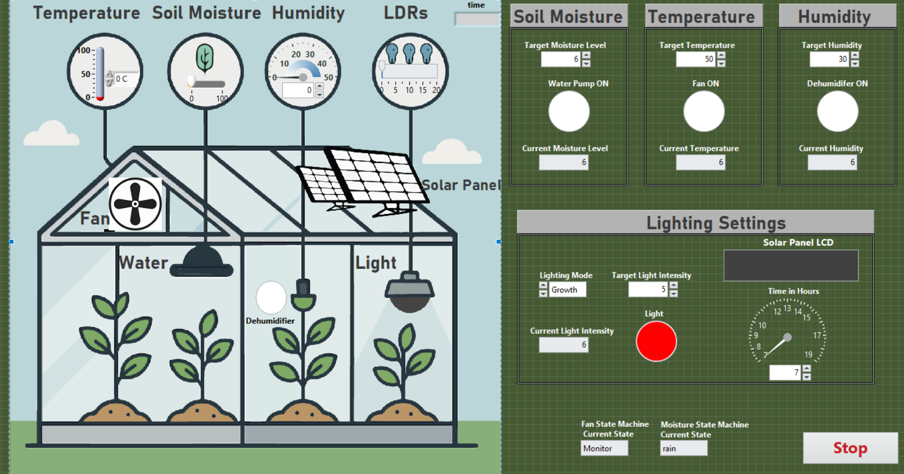

# Smart Greenhouse with Integrated Solar Tracking (LabVIEW)

A LabVIEW simulation of a smart greenhouse combined with a sun-tracking solar
panel. The system monitors and controls temperature, soil moisture, humidity, and
light intensity to keep the greenhouse within target ranges, while calculating the
angles a roof-mounted solar panel should adopt based on the time of day. It logs
the full run history to a delimited file on exit. I built this to model a complete
monitoring, control, and data-logging installation in software.

## Architecture
The application uses a parallel-loop design: four independent While loops run
concurrently, each owning one area of responsibility and running at its own rate.
Because the loops can't share data through wires, they communicate two ways:

- **Notifiers** for discrete event signals (e.g. the Temperature loop signalling
  the Fan loop that cooling is needed)
- **Local variables** for the steady stream of latest-value sensor readings

| Loop | Responsibility |
|------|----------------|
| Temperature Control | Simulates temperature, compares to target, drives fan demand |
| Fan State Machine | Ramps the ventilation fan smoothly between idle and running states |
| Light, Humidity & Solar | Regulates light and humidity; computes solar tracking angles |
| Soil Moisture State Machine | Controls the water pump, accounting for rain |

A single Event Structure handles all operator input. Data is buffered in memory
during the run via indexing tunnels, then flushed to disk in one pass by a logging
SubVI when the system stops, keeping file I/O out of the control loops.

## Features
- Temperature control with a live trend graph and ventilation fan
- Soil moisture control with a rain-aware water pump
- Humidity control via a dehumidifier
- Light intensity control with selectable lighting mode
- Solar panel tracking: computes vertical and horizontal angles by time of day
- Process-mimic front panel resembling the physical greenhouse
- Buffer-and-flush data logging to a delimited file

## Technical highlights
- 4 parallel While loops with Notifier + local-variable IPC
- 2 state machines (Fan, Soil Moisture)
- Single Event Structure for all user input
- Enum-driven Case Structures and typedef clusters
- Efficient indexing-tunnel logging strategy
- Dual stop mechanism: manual stop plus automatic error-driven shutdown

## Screenshots

**Front panel (greenhouse view)**

## Built with
- LabVIEW 2026 Q1
- Notifiers, state machines, and Write Delimited Spreadsheet File

## Skills demonstrated
LabVIEW, State Machines, Parallel Loops, Process Control, Data Logging, HMI Design
